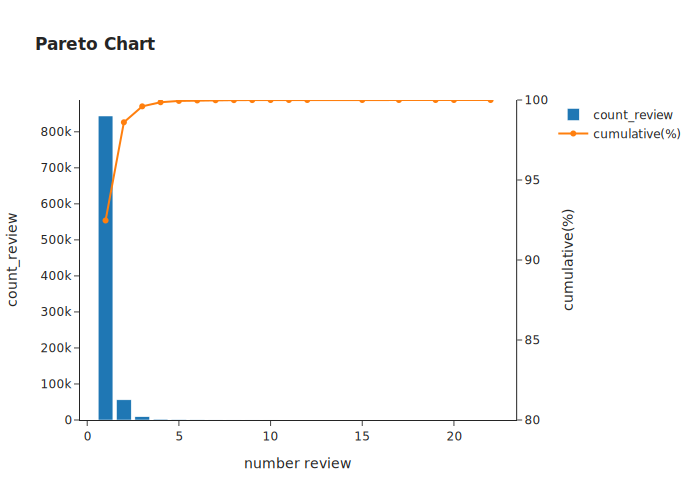
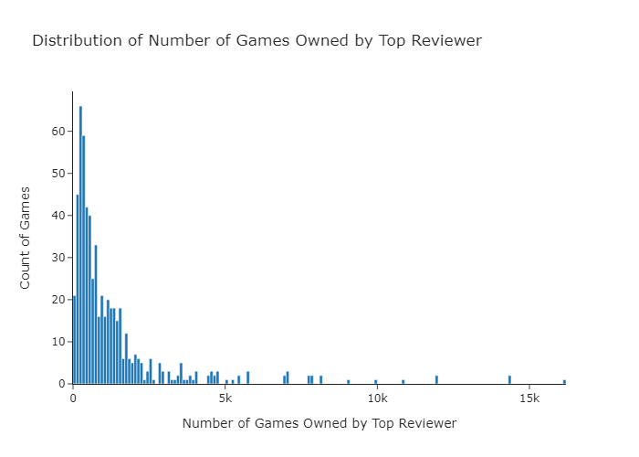
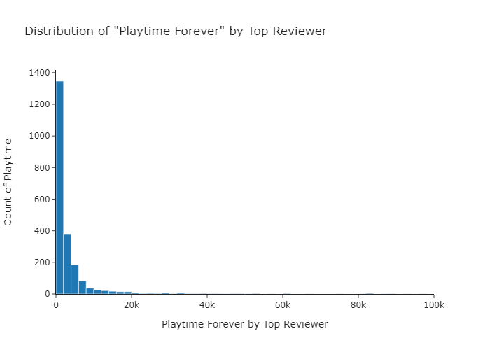
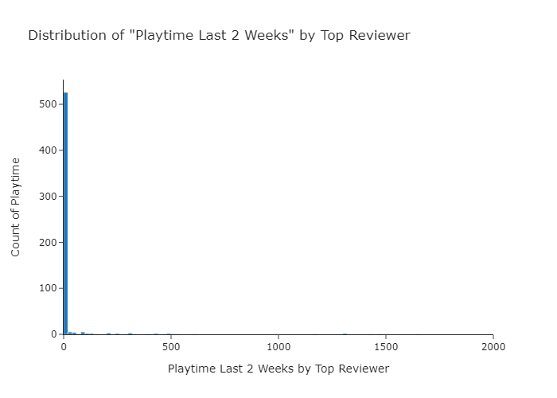
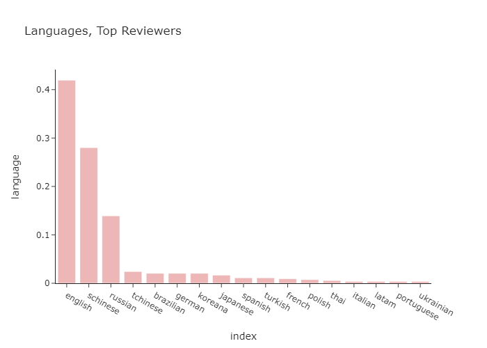
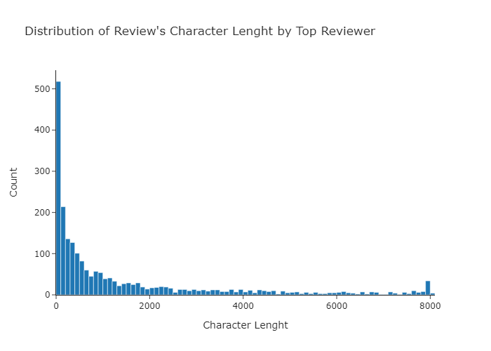
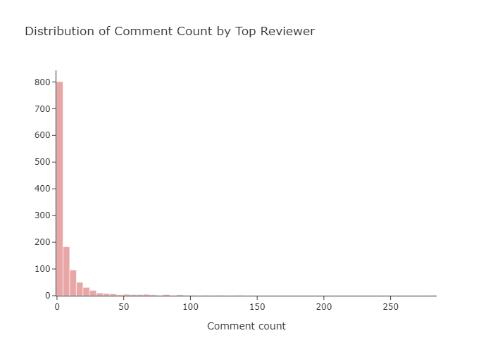
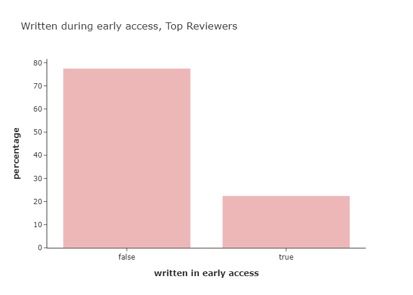

# finding_top_reviewers_-EDA-_DS004
Finding the top reviewers from the steam game platform

### Problem Statement
To make the community in the steam game platform more active, reviews from earlier access user are needed, becuase they are useful for others to give an early descriptions & experiences about the game and also for game developers it will be essential to fix & develop a better game performances. So, we should give the top reviewers incentives (e.g. early access, voucher, etc) for encouragement & appreciations ... and in the future it could be beneficial for the steam game platform.

### Needs
- We need to find who are the top reviewers.
- Take a look at the distribution of the top reviewers attributes.
- Take a look at the distribution of comments written by top reviewers.

### Data Exploration
The data exploration you could check in the notebooks above. I used plotly for visualization tasks. Plotly is quite handy and also interactive too.

### Key Findings
- **Most of the user only wrote 1 review (92,47%)**. Of course we don't want this and it is out of top reviewers criteria. Take a look at the pareto chart below.

- Let's limit the top reviewers as people who at least wrote 3 reviews & got at least 100 review_useful value.
- Next let's take a look at the **games owned by top reviewers**! Most of them have **100 - 400 games** in the games platform... Wow!

- The top reviewers **playtime forever** is **0 - 1999 hours**

- The top reviewers **playtime for last 2 weeks** is **0 - 19 hours**

- Most of top reviewers use **English, Simplified Chinese, & Russian language**

- Next let's take a look at the **character lenght from the reviews** of top reviewers! Most of them have **0 - 99 characters**.

- From top reviewers' reviews, they get **0 - 4 comments**.

- and most of **reviews written not in early access phase (77.52%)**.

### Acknowledgements
This quick project is inspired by [Shashank Kalanithi](https://www.youtube.com/c/ShashankKalanithiData)
